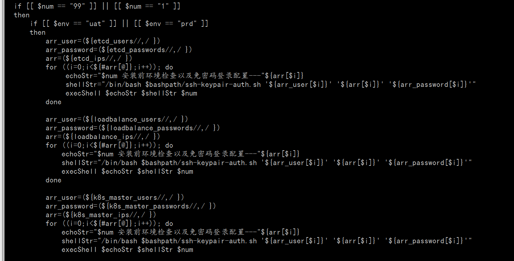
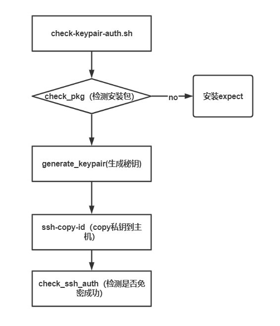
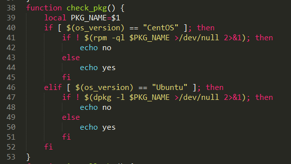
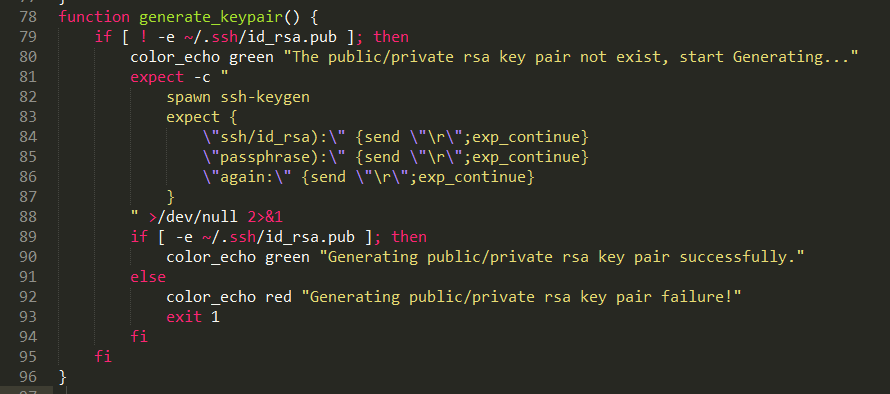
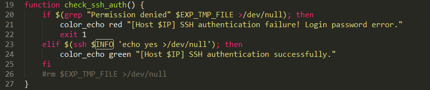

# 1-1当前环境检查以及免密登录配置 

## 脚本与参数截图

路径deploy-all/install.sh



## ssh-keypair-auth.sh剖析

### 脚本函数剖析如下：

.png)

### 脚本思路图如下：



### 函数细节剖析：

#### check_pkg



##### 知识点：

###### 区分 rpm -qi -qf  -ql  -qa四个不同选项组合的作用？

```shell
rpm -qi 包名 查看一个包的详细信息

rpm -qf 文件名 查看一个文件是由哪个包安装的

rpm -ql 包名 查看一个包安装了哪些文件

rpm -qa 查看系统中安装了哪些包
```

出处：http://www.bubuko.com/infodetail-1874982.html

#### generate_keypair



##### 扩展点：

###### expect

expect是一个自动化交互套件，主要应用于执行命令和程序时，系统以交互形式要求输入指定字符串，实现交互通信。

expect自动交互流程：

spawn启动指定进程---expect获取指定关键字---send向指定程序发送指定字符---执行完成退出.

expect常用命令总结:

[](javascript:void(0);)

```shell
spawn               交互程序开始后面跟命令或者指定程序
expect              获取匹配信息匹配成功则执行expect后面的程序动作
send exp_send       用于发送指定的字符串信息
exp_continue        在expect中多次匹配就需要用到
send_user           用来打印输出 相当于shell中的echo
exit                退出expect脚本
eof                 expect执行结束 退出
set                 定义变量
puts                输出变量
set timeout         设置超时时间
```

出处：https://www.cnblogs.com/saneri/p/10819348.html

##### check_ssh_auth



###### 知识点：

使用 ssh root@127.0.0.1 ‘echo yes’ 方式来验证是否免密登录

