# 2.2 部署master的负载均衡节点

## 脚本与参数截图

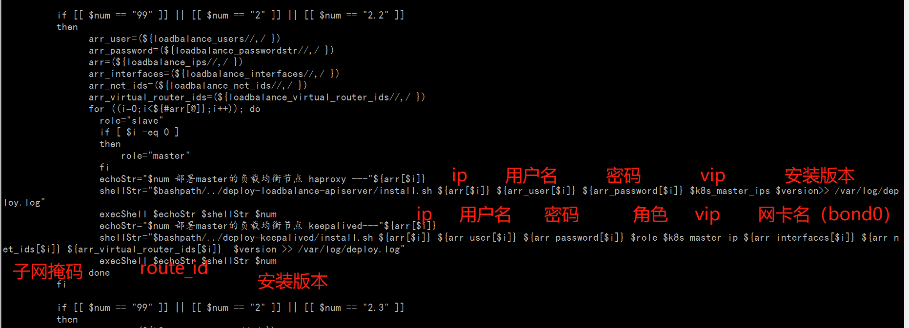


## haproxy部署

### install.sh脚本剖析

1. 将该脚本copy到 远程主机；

2. 远程ssh调用 install-sub.sh脚本

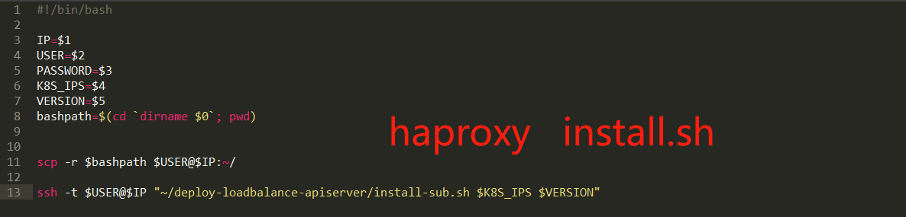

### install-sub.sh脚本剖析

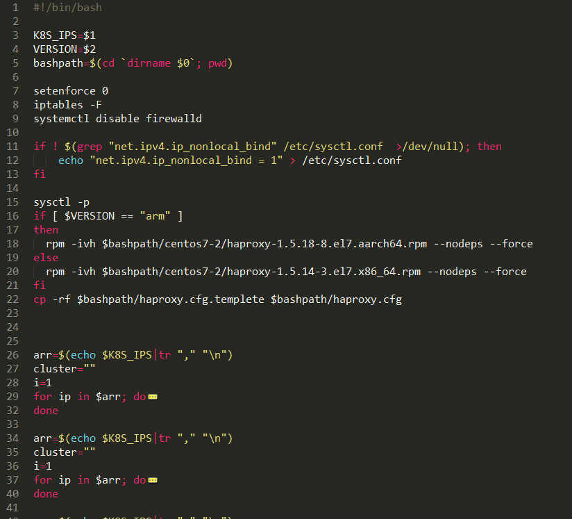

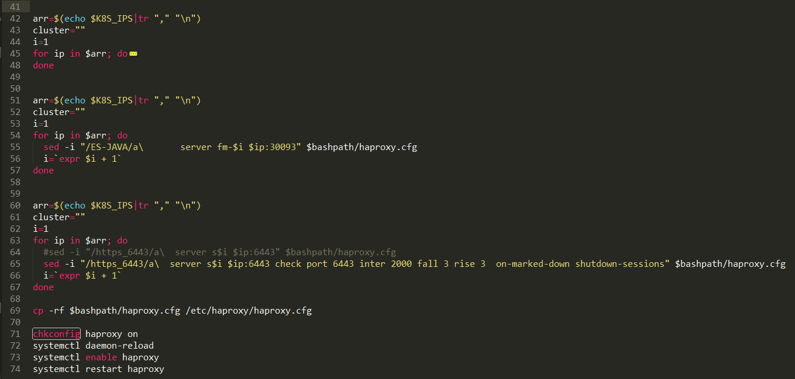

#### 剖析流程图如下：

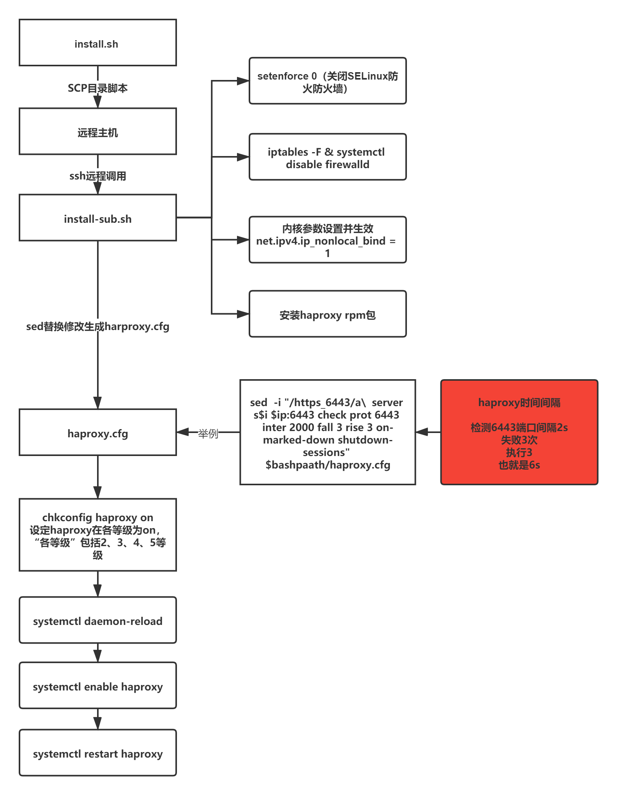

### haproxy.cfg详解

#### 配置截图：

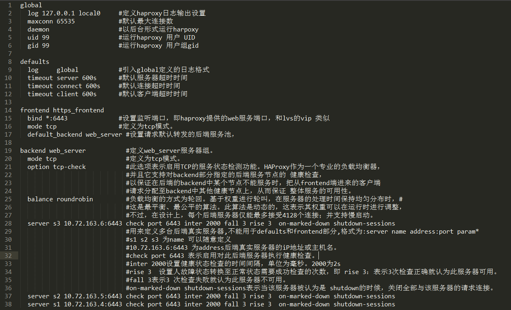

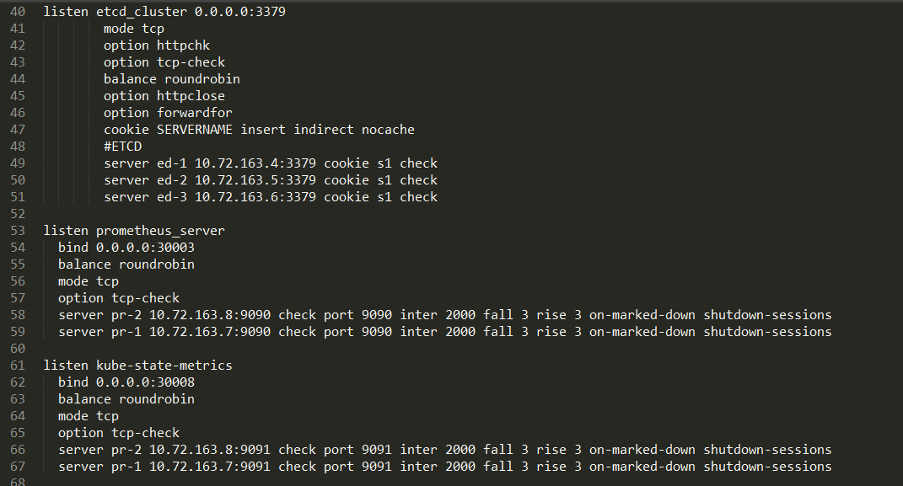

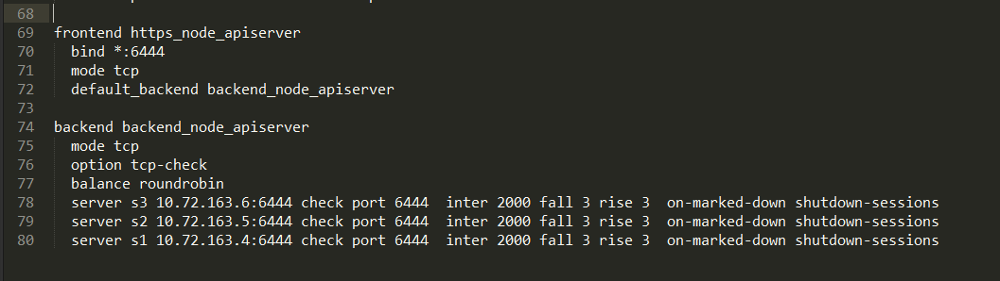

#### 知识点：

###### 1.**net.ipv4.ip_nonlocal_bind = 1** 内核参数详解

nonlocal 非本地

```shell
net.ipv4.ip_nonlocal_bind：
此参数表示是否允许服务绑定一个本机不存在的IP地址； 
使用场景：有些服务需要依赖一个vip才能启动，但是此vip不在本机上，当vip飘移到本机上时才存在；但是服务又需要提前启动，例如haproxy,nginx等代理需要绑定vip时； 
0：默认值，表示不允许服务绑定一个本机不存的地址 
1：表示允许服务绑定一个本机不存在的地址
```

出处：https://blog.51cto.com/liuzhengwei521/2338512

###### 2. chkconfig haproxy on 的含义？  chkconfig详解

chkconfig命令主要用来更新（启动或停止）和查询系统服务的运行级信息。谨记chkconfig不是立即自动禁止或激活一个服务，它只是简单的改变了符号连接。


chkconfig用户解释

1. 在没有参数运行时，显示用法。
2. 如果加上服务名，那么就检查这个服务是否在当前运行级启动。如果是，返回true，否则返回false。
3. 如果在服务名后面指 定了on，off或者reset，那么chkconfig 会改变指定服务的启动信息。on和off分别指服务被启动和停止，reset指重置服务的启动信息，无论有问题的初始化脚本指定了什么。on和off开 关，系统默认只对运行级3，4，5有效，但是reset可以对所有运行级有效。


**参数用法：**

```
–add 　增加所指定的系统服务，让chkconfig指令得以管理它，并同时在系统启动的叙述文件内增加相关数据。
–del 　删除所指定的系统服务，不再由chkconfig指令管理，并同时在系统启动的叙述文件内删除相关数据。
–level<等级代号> 　指定读系统服务要在哪一个执行等级中开启或关毕。
等级0表示：表示关机
等级1表示：单用户模式
等级2表示：无网络连接的多用户命令行模式
等级3表示：有网络连接的多用户命令行模式
等级4表示：不可用
等级5表示：带图形界面的多用户模式
等级6表示：重新启动
```

适用范例：

```shell
chkconfig –list    #列出所有的系统服务
chkconfig –add httpd    #增加httpd服务
chkconfig –del httpd    #删除httpd服务
chkconfig –level httpd 2345 on    #设置httpd在运行级别为2、3、4、5的情况下都是on（开启）的状态
chkconfig –list    #列出系统所有的服务启动情况
chkconfig –list mysqld    #列出mysqld服务设置情况
chkconfig –level 35 mysqld on    #设定mysqld在等级3和5为开机运行服务，–level 35表示操作只在等级3和5执行，on表示启动，off表示关闭
chkconfig mysqld on    #设定mysqld在各等级为on，“各等级”包括2、3、4、5等级
```

出处：http://www.ttlsa.com/linux-command/linux-chkconfig-1/

## keepalived部署


#### $role的判断逻辑：

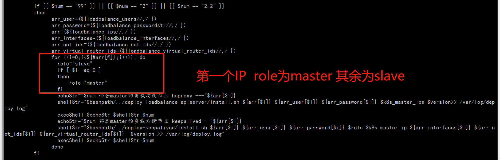

### install.sh剖析

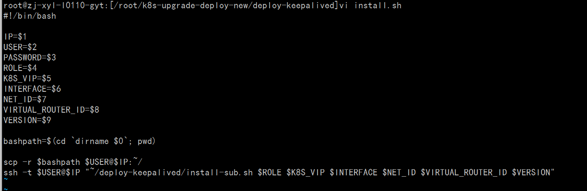

### install-sub.sh剖析

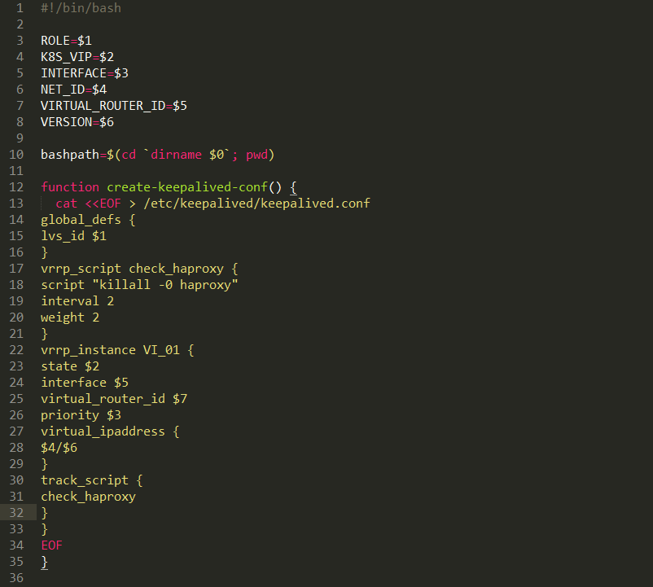

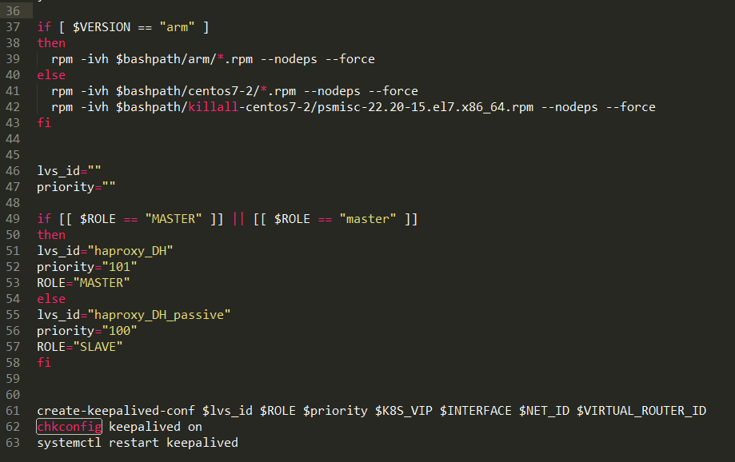

### 剖析流程图如下：

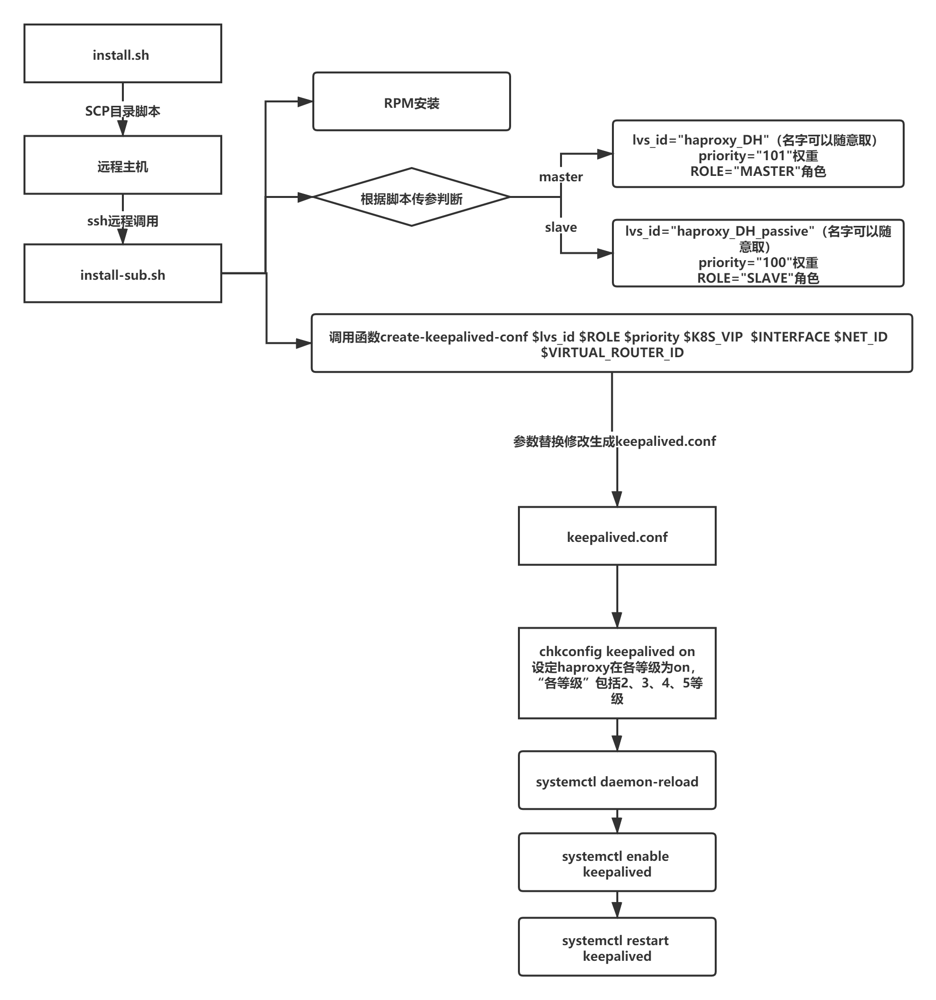
