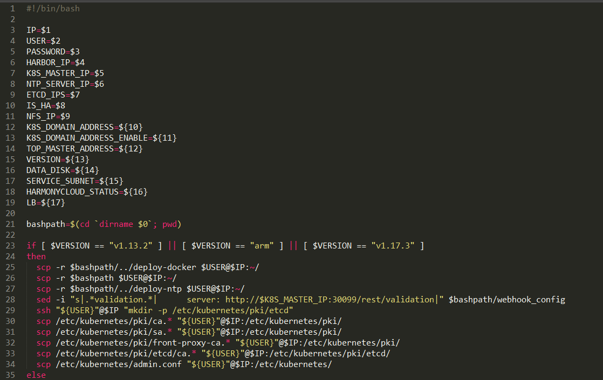

# 部署master节点

## ntp安装

默认ntp参数为false，采用手动安装ntp  安装方式为：

1.修改ntp.conf文件， 注释server ，增加新的server ntp IP


2.重启ntpd，生效；

查看ntp延迟并验证主机是否有延迟： 

```shell
ntp -p
```


## deplay-all/install.sh


### 单节点部署脚本剖析

#### deploy-k8s/install-master-sub.sh


流程：

1.根据传参变量生成kubeadm-conf.yaml

2.kubeadm init --config=kubeadm-conf.yaml 部署master节点

3.部署好之后替换vip到 kuebelt.conf admin.conf等文件

4.增加webhook外部认证方式-->修改kube-apiserver.yaml

### kubeadm-conf.yaml


### scp-kubernetes.sh （高可用部署master）




1.部署好单节点master之后，可调用本脚本进行扩容；

2.将/etc/kubernetes/pki下的证书都传入到待扩容主机；

3.执行install-master-sub-v1.13.2.sh

#### install-master-sub-v1.13.2.sh


1.使用install-kubeadm.sh（docker、kubeadm、kubelet安装、modprobe参数启动）内核参数（bridge-nf-call-iptables、ip_forward内核参数开启、Kubelet启动参数修改）

2.kubeadm join   --control-plane 修改加入master


### install-kubeadm.sh


知识点：

