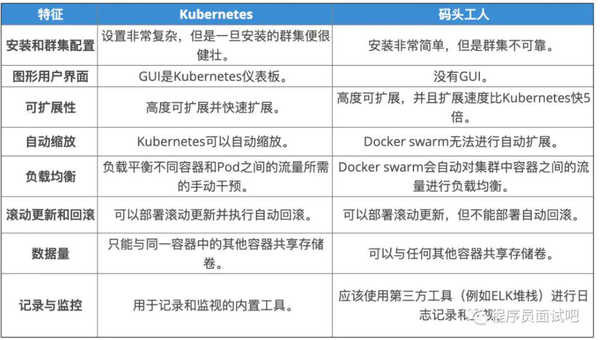
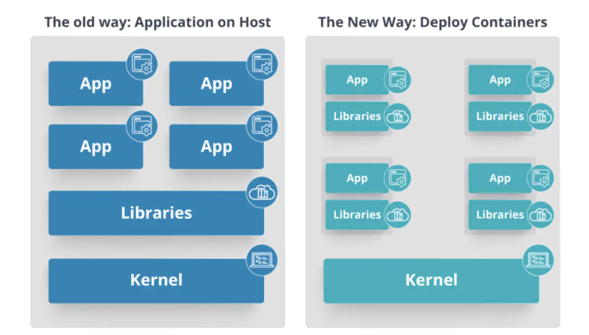
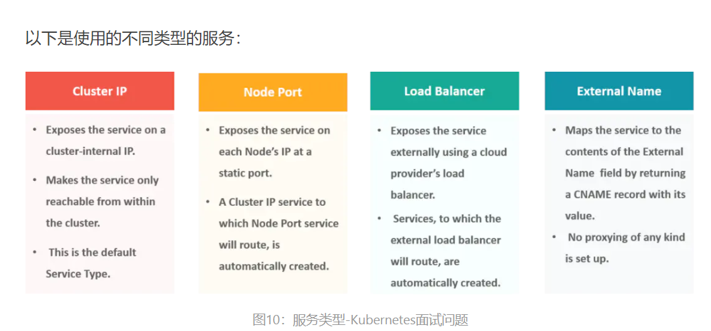
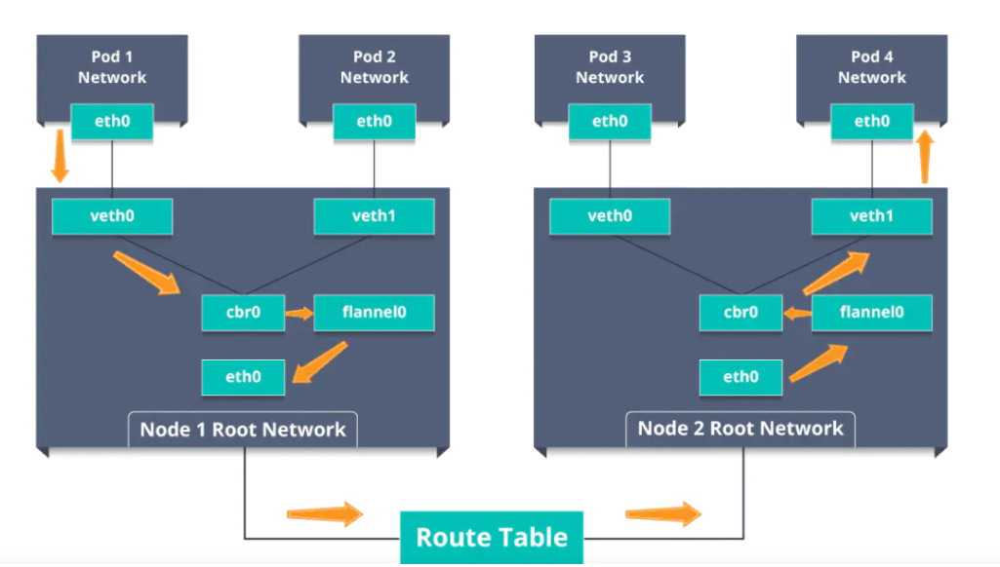

Kubernetes一直是当今市场的流行语，并且是最好的编排工具。 下面将K8s面试问题分为以下3个部分：

1. Kubernetes基本面试问题
2. 基于架构的面试题
3.  基于场景的面试题

### **Kubernetes基本面试问题**

### **Q1.Kubernetes与Docker Swarm有何不同？**

### **Q2.什么是Kubernetes？**

Kubernetes是一个开源容器管理工具，它负责容器部署，容器的缩放和除垢以及负载平衡的职责。作为Google的创意，它提供了出色的社区，并且与所有云提供商都精采合作。因此，我们可以说Kubernetes不是 一个容器化平台，而是一个多容器管理解决方案。

### **Q3.Kubernetes与Docker有何关系？**

众所周知，Docker提供了容器的生命周期管理，而Docker映像构建了运行时容器。但是，由于这些容器必须进行通信，因此使用了Kubernetes。因此，Docker构建了容器，这些容器通过Kubernetes相互通信。因此，可以使用Kubernetes手动链接和协调在多个主机上运行的容器。

### **Q4.在主机和容器上部署应用程序有什么区别？**

左侧的体系结构表示在主机上部署应用程序。因此，这种体系结构将具有一个操作系统，然后该操作系统将具有一个内核，该内核将在应用程序所需的操作系统上安装各种库。因此，在这种框架中，您可以有n个应用程序，并且所有应用程序都将共享该操作系统中存在的库，而在容器中部署应用程序时，体系结构则有所不同。

这种架构将具有内核，这是唯一的东西，它将成为所有应用程序之间唯一的共同点。因此，如果有一个需要Java的特定应用程序，那么我们将可以访问该特定应用程序；如果有另一个需要Python的应用程序，则只有该特定应用程序可以访问Python。

您可以在图的右侧看到的各个块基本上都是容器化的，并且与其他应用程序隔离。因此，应用程序具有与系统其余部分隔离的必要库和二进制文件，并且不会被任何其他应用程序所侵害。

### **Q5.什么是容器编排？**

考虑一个应用程序有5-6个微服务的情况。现在，这些微服务放置在单独的容器中，但是如果没有容器编排，将无法进行通信。因此，由于编排意味着将所有乐器在音乐中和谐地融合在一起，因此类似的容器编排意味着单个容器中的所有服务可以一起工作以满足单个服务器的需求。

## **02**. **基于架构的Kubernetes面试问题**

### **Q1.Kubernetes体系结构有哪些不同的组成部分？**

Kubernetes架构主要包含两个组件-主节点和工作节点。如下图所示，主节点和工作节点中有许多内置组件。主节点具有kube-controller-manager，kube-apiserver，kube-scheduler等。而工作程序节点在每个节点上都运行kubelet和kube-proxy。

### **Q2.您对Kube-proxy了解什么？**

Kube-proxy可以在每个节点上运行，并且可以跨后端网络服务执行简单的TCP / UDP数据包转发。因此，基本上，它是一个网络代理，可反映每个节点上Kubernetes API中配置的服务。因此，可与Docker链接的兼容环境变量提供了由代理打开的群集IP和端口。

### **Q3.您能否简要介绍一下Kubernetes中主节点的工作？**

Kubernetes主节点控制节点，并且在节点内部存在容器。现在，这些单独的容器包含在Pod内，每个Pod内，您可以根据配置和要求拥有各种数量的容器。因此，如果必须部署Pod，则可以使用用户界面或命令行界面来部署它们。然后，在节点上调度这些Pod，并根据资源需求将Pod分配给这些节点。kube-apiserver确保在Kubernetes节点和主组件之间建立了通信。

### **Q4.kube-apiserver和kube-scheduler的作用是什么？**

kube – apiserver遵循横向扩展架构，并且是主节点控制面板的前端。这将公开Kubernetes主节点组件的所有API，并负责在Kubernetes节点和Kubernetes主组件之间建立通信。

kube调度程序负责在工作节点上分配和管理工作负载。因此，它根据资源需求选择最合适的节点来运行计划外的Pod，并跟踪资源利用率。它可以确保未在已满的节点上调度工作负载。

### **Q5.您能简要介绍一下Kubernetes控制器管理器吗？**

多个控制器进程在主节点上运行，但被编译在一起以作为单个进程（即Kubernetes Controller Manager）运行。因此，Controller Manager是一个守护程序，它嵌入控制器并执行名称空间创建和垃圾回收。它负责并与API服务器通信以管理端点。

### **Q6.什么是ETCD？**

​	Etcd用Go编程语言编写，并且是用于在分布式工作之间进行协调的分布式键值存储。因此，Etcd存储Kubernetes集群的配置数据，该数据表示集群在任何给定时间点的状态。

### **Q7.Kubernetes中有哪些不同类型的服务？** 

### **Q8.您对Kubernetes中的负载均衡器了解什么？**

负载平衡器是公开服务的最常见和标准的方式之一。根据工作环境使用两种类型的负载均衡器，即内部负载均衡器或外部负载均衡器。内部负载平衡器会自动平衡负载并为Pod分配所需的配置，而外部负载平衡器会将流量从外部负载定向到后端Pod。

### **Q9.什么是Ingress网络？它如何工作？**

入口网络是充当Kubernetes集群入口点的规则的集合。这允许入站连接，可以将其配置为通过可访问的URL，负载平衡流量或通过提供基于名称的虚拟主机在外部提供服务。因此，Ingress是一个API对象，通常通过HTTP管理对集群中服务的外部访问，这是公开服务的最强大方法。

现在，让我通过一个示例向您解释Ingress网络的工作原理。

有2个节点具有带有Linux网桥的pod和根网络名称空间。除此之外，还向根网络添加了一个名为flannel0（网络插件）的新虚拟以太网设备。

现在，假设我们希望数据包从pod1到pod4。请参考下图。

因此，数据包在eth0离开pod1的网络，并在veth0进入根网络。

然后将其传递给cbr0，后者发出ARP请求以查找目标，并且发现该节点上没有人具有目标IP地址。

因此，网桥将数据包发送到flannel0，因为节点的路由表已配置了flannel0。

现在，法兰绒守护程序与Kubernetes的API服务器进行对话，以了解所有Pod IP及其各自的节点，以创建Pod IP到节点IP的映射。

网络插件将该数据包包装在带有额外报头的UDP数据包中，该报头将源IP和目标IP更改为它们各自的节点，并通过eth0发送此数据包。

现在，由于路由表已经知道如何在节点之间路由流量，因此它将数据包发送到目标节点2。

数据包到达节点2的eth0，然后返回flannel0进行解封装，然后将其发送回根网络名称空间。

再次，将数据包转发到Linux网桥，以发出ARP请求以找出属于veth1的IP。

数据包最终穿过根网络并到达目标Pod4。

## **03.** 基于场景的面试题

方案1： 假设一家基于整体架构的公司处理许多产品。现在，随着公司在当今规模化行业中的发展，其整体架构开始引起问题。*您如何看待公司从单一服务转向微服务并部署其服务容器？*

解：由于该公司的目标是从单一应用程序转变为微服务，因此它们最终可以一步一步地并行构建，而只需在后台切换配置即可。然后，他们可以将每个内置微服务放在Kubernetes平台上。因此，他们可以从迁移服务一次或两次并监视它们以确保一切运行稳定开始。一旦他们感觉一切顺利，就可以将应用程序的其余部分迁移到其Kubernetes集群中。

方案2：考虑一家拥有非常分散的系统，拥有大量数据中心，虚拟机以及许多从事各种任务的员工的跨国公司。*您认为这样* *的公司如何与Kubernetes一致地管理所有任务？*

解：众所周知，IT部门启动了数千个容器，任务在分布式系统中的多个节点上运行。

在这种情况下，公司可以使用能够为基于云的应用程序提供敏捷性，横向扩展功能和DevOps实践的功能。

因此，该公司可以使用Kubernetes定制其调度架构并支持多种容器格式。这使得容器任务之间的亲和力成为可能，它通过对各种容器联网解决方案和容器存储的广泛支持而提高了效率。

方案3： 考虑一种情况，公司希望通过保持最低成本来提高效率和技术运营速度。*您如何看待公司将如何实现这一目标？*

解：该公司可以通过构建CI / CD管道来实现DevOps方法，但是此处可能出现的一个问题是，配置可能需要花费一些时间才能启动并运行。因此，在实施CI / CD管道之后，公司的下一步应该是在云环境中工作。一旦他们开始在云环境中工作，他们就可以在集群上调度容器，并可以在Kubernetes的帮助下进行编排。这种方法将帮助公司减少部署时间，并在各种环境中更快地完成部署。

方案4： 假设一家公司想要修改其部署方法，并希望构建一个可扩展性和响应性更高的平台。*您如何看待这家公司能够实现这一目标以满足他们的客户？*

解：为了给数百万客户提供他们期望的数字体验，该公司需要一个可扩展且响应迅速的平台，以便他们可以快速将数据获取到客户网站。现在，要做到这一点，公司应该从其私有数据中心（如果他们使用的是任何数据中心）迁移到任何云环境（例如AWS）。不仅如此，他们还应该实现微服务架构，以便他们可以开始使用Docker容器。一旦他们准备好了基础框架，便可以开始使用可用的最佳编排平台，即Kubernetes。这将使团队能够自主构建应用程序并非常快速地交付它们。

方案5：考虑一家拥有非常分散的系统的跨国公司，希望解决整体代码库问题。*您认为公司如何解决他们的问题？*

解：好了，要解决该问题，他们可以将其整体代码库转移到微服务设计中，然后将每个微服务都视为一个容器。因此，所有这些容器都可以在Kubernetes的帮助下进行部署和编排。

场景6： 我们所有人都知道从单服务到微服务的转变从开发方面解决了问题，但在部署方面却增加了问题。*公司如何解决部署方面的问题？*

解：该团队可以尝试使用容器编排平台（例如Kubernetes）并在数据中心中运行它。因此，借助此工具，该公司可以生成模板化的应用程序，在五分钟内对其进行部署，并在此时将实际实例包含在登台环境中。这种Kubernetes项目将具有数十个并行运行的微服务，以提高生产率，即使节点发生故障，也可以立即对其进行重新调度，而不会影响性能。

方案7： 假设一家公司希望通过采用新技术来优化其工作负载的分配。*公司如何有效地实现这种资源分配？*

解：解决这个问题的方法莫过于Kubernetes。Kubernetes确保有效地优化资源，并且仅使用特定应用程序所需的那些资源。因此，通过使用最佳的容器编排工具，公司可以有效地实现资源分配。

方案8： 考虑一家拼车公司希望通过同时扩展其平台来增加服务器数量。*您认为公司将如何处理服务器及其安装？*

解：公司可以采用集装箱化的概念。一旦将所有应用程序部署到容器中，他们就可以使用Kubernetes进行编排，并使用Prometheus等容器监视工具来监视容器中的动作。因此，使用这样的容器，可以为它们提供更好的数据中心容量规划，因为由于服务和运行的硬件之间的这种抽象，它们现在将具有更少的约束。

方案9： 考虑一个公司要向具有各种环境的客户提供所有必需的分发产品的方案。*您如何看待他们如何动态地实现这一关键目标？*

解：该公司可以使用Docker环境，组成一个跨部门团队，以使用Kubernetes构建Web应用程序。这种框架将帮助公司实现在最短时间内将所需物品投入生产的目标。因此，通过运行这种机器，公司可以向所有具有各种环境的客户提供帮助。

场景10：假设一家公司希望在从裸机到公共云的不同云基础架构上运行各种工作负载。*在存在不同接口的情况下，公司将如何实现这一目标？*

解：该公司可以将其基础架构分解为微服务，然后采用Kubernetes。这将使公司在不同的云基础架构上运行各种工作负载。