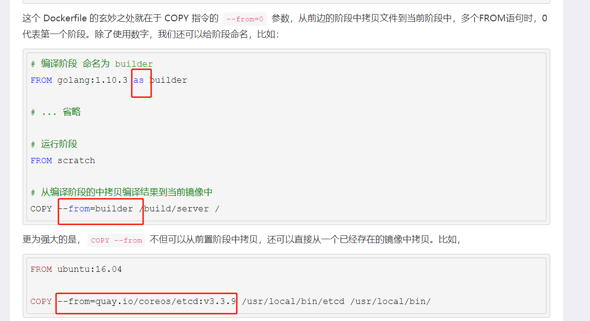

## COPY与ADD的区别： COPY:直接拷贝;  ADD:拷贝+解压功能


a.二者都是只复制目录中的文件，而不包含目录本身。
b.COPY能干的事ADD都能干，甚至还有附加功能。
c.ADD可以支持拷贝的时候顺带解压缩文件，以及添加远程文件(不在本宿主机上的文件),COPY的<src>只能是本地文件
d.只是文件拷贝的话可以用COPY，有额外操作可以用ADD代替。
e.docker官方建议当要从远程复制文件时，尽量用curl/wget命令来代替ADD。因为用ADD的时候会创建更多的镜像层。镜像层的size也大。


#### Namespace

Linux 里面的 Namespace 机制。而 Namespace 的使用方式也非常有意思：它其实只是 Linux 创建新进程的一个可选参数。我们知道，在 Linux 系统中创建线程的系统调用是 clone()，

而当我们用 clone() 系统调用创建一个新进程时，就可以在参数中指定 CLONE_NEWPID 参数

```
int pid = clone(main_function, stack_size, CLONE_NEWPID | SIGCHLD, NULL); 
```

这时，新创建的这个进程将会“看到”一个全新的进程空间，在这个进程空间里，它的 PID 是 1。之所以说“看到”，是因为这只是一个“障眼法”，在宿主机真实的进程空间里，这个进程的 PID 还是真实的数值，比如 100。

Mount Namespace，用于让被隔离进程只看到当前 Namespace 里的挂载点信息；

Network Namespace，用于让被隔离进程看到当前 Namespace 里的网络设备和配置。

进程隔离：pid namespace
网络隔离：net namespace
挂载点隔离：mount namespace
进程间通信隔离：ipc namespace
独立的用户、用户组：user namespace
独立的hostname、domain name：uts namespace


#### Cgroups

Linux Cgroups 的设计还是比较易用的，简单粗暴地理解呢，它就是一个子系统目录加上一组资源限制文件的组合。而对于 Docker 等 Linux 容器项目来说，它们只需要在每个子系统下面，为每个容器创建一个控制组（即创建一个新目录），然后在启动容器进程之后，把这个进程的 PID 填写到对应控制组的 tasks 文件中就可以了。

/sys/fs/cgroups

除 CPU 子系统外，Cgroups 的每一个子系统都有其独有的资源限制能力，比如：

blkio，为块设备设定I/O 限制，一般用于磁盘等设备；

cpuset，为进程分配单独的 CPU 核和对应的内存节点；

memory，为进程设定内存使用的限制。


## 联合文件系统


如何改变文件视图

在 Linux 操作系统里，有一个名为 chroot 的命令可以帮助你在 shell 中方便地完成这个工作。顾名思义，它的作用就是帮你“change root file system”，即改变进程的根目录到你指定的位置。

```
chroot $HOME/test /bin/bash
```

**Mount Namespace 正是基于对 chroot 的不断改良才被发明出来的，它也是 Linux 操作系统里的第一个 Namespace。**

**实际上，同一台机器上的所有容器，都共享宿主机操作系统的内核。**


#### layer

**Docker 在镜像的设计中，引入了层（layer）的概念。也就是说，用户制作镜像的每一步操作，都会生成一个层，也就是一个增量 rootfs。**

Union File System 也叫 UnionFS，最主要的功能是将多个不同位置的目录联合挂载（union mount）到同一个目录下。

镜像的层都放置在 /var/lib/docker/aufs/diff 目录下，然后被联合挂载在 /var/lib/docker/aufs/mnt 里面。

**第一部分，只读层**。它是这个容器的 rootfs 最下面的五层，对应的正是 ubuntu:latest 镜像的五层。

**第二部分，可读写层**。它是这个容器的 rootfs 最上面的一层（6e3be5d2ecccae7cc），它的挂载方式为：rw，即 read write。在没有写入文件之前，这个目录是空的。而一旦在容器里做了写操作，你修改产生的内容就会以增量的方式出现在这个层中。

**第三部分，Init 层**。它是一个以“-init”结尾的层，夹在只读层和读写层之间。Init 层是 Docker 项目单独生成的一个内部层，专门用来存放 /etc/hosts、/etc/resolv.conf 等信息。


### overlay2

/var/lib/docker/overlay2目录，通过docker inspect命令可以查看到镜像在该目录下生成的各种目录文件，
LowerDir：指向镜像层；
UpperDir：指向容器层，在容器中创建文件后，文件出现在此目录；
MergedDir：容器挂载点 ，lowerdir和upperdir整合起来提供统一的视图给容器，作为根文件系统；
WorkDir：用于实现copy_up操作。


### Copy on Write

在容器中修改文件时，Docker会从上到下依次在各镜像层中查找比文件。找到后，会把此文件复制到容器层（可读写层），然后修改。这就是 Copy on Write.


#### dockerfile

可以写多个FROM，只不过只有最后一个生效。

意义：

**每一条 FROM 指令都是一个构建阶段，多条 FROM 就是多阶段构建，虽然最后生成的镜像只能是最后一个阶段的结果，但是，能够将前置阶段中的文件拷贝到后边的阶段中，这就是多阶段构建的最大意义。**

如何使用前一阶段的文件？


方式1：


方式2：




## zookeeper 的选举算法：