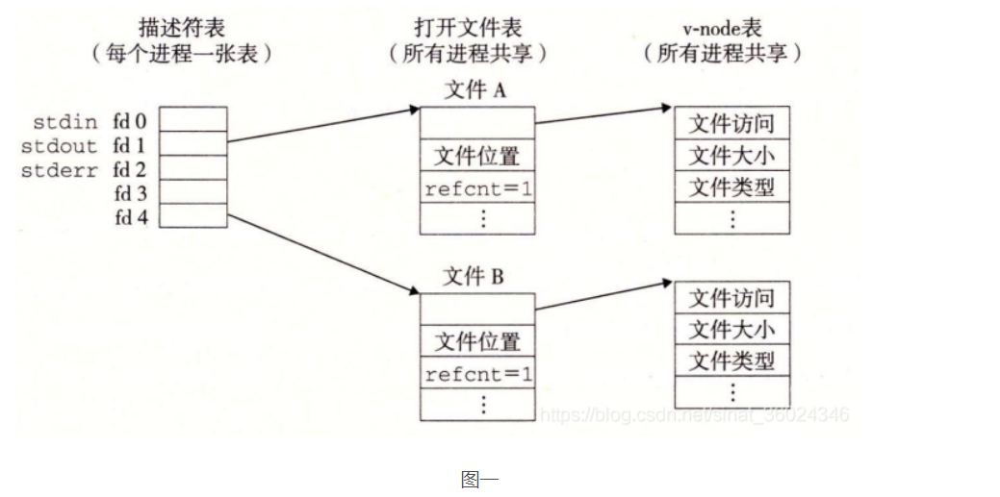
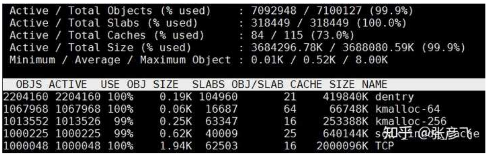

# **TCP**并发连接知识


每个TCP连接都会创建一个句柄（包括文件file、通讯连接socket、正在监听的端口等），当进程打开进程数超过系统限制时（⽤户进程的最⼤可打开⽂件数量限制（nofile）、系统单个进程可打开的最⼤数量（nr）、当前系统可打开的最⼤数量 (fs.file-max)）有关，系统为每一个进程维护了一个文件描述符表，所以在不同的进程中会看到相同的fd，**内核对所有打开的文件都有一个系统级的文件描述符表**,文件描述符又记录了i-node表的索引，进而访问i-node表。

需要明白几个内核参数：

- fs.file-max： 当前系统可打开的最⼤数量 
- fs.nr_open： 当前系统单个进程可打开的最⼤数量 
- nofile： 每个⽤户的进程可打开的最⼤数量
- net.ipv4.ip_local_port_range   匿名端口范围
- net.ipv4.ip_conntrack_max  系统对最大跟踪的TCP连接数跟踪


## 进程和句柄概念

一个程序可能会打开多个实体，即进程；

**一个进程在运行中会打开很多资源，包括文件file、通讯连接socket、正在监听的端口等，我们把这些统称为句柄**（handle），Linux中任何东西都是文件，所以当一个进程打开的句柄数超过系统限制时，，我们会收到告警：too many open files。

## 文件描述符（fd ）概念

**本质上是一个索引号（非负整数），系统用户层可以根据它找到系统内核层的文件数据。**这是一个POSIX标准下的概念，常见于Linux系统。内核（kernel）利用文件描述符来访问文件。打开现存文件或新建文件时，内核会返回一个文件描述符。读写文件也需要文件描述符来指定待读写的文件。


文件描述符（file descriptor, fd）是Linux系统中对已打开文件的一个抽象标记，所有I/O系统调用对已打开文件的操作都要用到它。这里的“文件”仍然是广义的，即除了普通文件和目录外，还包括管道、FIFO（命名管道）、Socket、终端、设备等。

文件描述符是一个较小的非负整数，并且0、1、2三个描述符总是默认分配给标准输入、标准输出和标准错误。这就是常用的`nohup ./my_script > my_script.log 2>&1 &`命令里2和1的由来。


简单来说，每个进程都有一个打开的文件表（fdtable)。表中的每一项是struct file类型，包含了打开文件的一些属性比如偏移量，读写访问模式等，这是真正意义上的文件句柄。

而这其中，文件描述符可以理解为一个fdtable的下标，文件句柄是下标指向的数据（这块可以类比于数据下标和数据中的元素）


每个文件描述符都与一个文件所对应的，不同的文件描述符也可能会指向同一个文件

**系统为每一个进程维护了一个文件描述符表，所以在不同的进程中会看到相同的fd。**那么要理解具体的内部结构，需要理解下面这三个数据结构：

- 进程级的文件描述符表
- 系统级的打开文件描述符表
- 文件系统i-node表


- **进程级别的文件描述符表**每一条都只是记录了单个文件描述符的信息，主要包含下面几个：
  - 控制文件描述符操作的一组标志
  - 对打开文件句柄的引用

**内核对所有打开的文件都有一个系统级的文件描述符表**，各条目称为打开文件句柄（open file handle）一个打开文件句柄存储了一个与一个打开文件相关的所有信息

- 当前文件偏移量（调用read()和write()时更新，或使用lseek()直接修改）
- 打开文件时的标识（open()的flags参数）
- 文件访问模式（读写）
- 与信号驱动相关的设置
- 对该文件i-node对象的引用
- 文件类型（常规文件、socket等）和访问权限
- 一个指针，指向该文件所持有的锁列表
- 文件的各种属性，时间戳啥的，巴拉巴拉

文件描述符、打开的文件句柄、i-node关系总结如下：





## ⼀、**TCP** 并发理论基础 

### **1** 服务器理论最大并发数 

TCP连接四元组是由源IP地址、源端⼝、⽬的IP地址和⽬的端⼝构成。 

**当四元组中任意⼀个元素发⽣了改变，那么就代表的是⼀条完全不同的新连接。** 

我们算下服务器上理论上能达成的最⾼并发数量。拿我们常⽤的 Nginx 举例，假设它的 IP 是 A，端⼝ 80。这样就只剩下源IP地址、源端⼝是可变的。 

IP 地址是⼀个 32 位的整数，所以源 IP 最⼤有 2 的 32 次⽅这么多个。 端⼝是⼀个 16 位的整数，所以端⼝的数量就是 2 的 16 次⽅。 

2 的 32 次⽅（ip数）× 2的 16 次⽅（port数）⼤约等于两百多万亿。 

所以理论上，我们每个 server 可以接收的连接上限就是两百多万亿。（不过每条 TCP 连接都会消耗服务 器内存，实践中绝不可能达到这个理论数字，稍后我们就能看到。） 

### **2** 客户端理论最大并发数

> 注意：这⾥的客户端是⼀个⻆⾊，并不具体指的是哪台机器。当你的 java/c/go 程序响应⽤户请 求的时候，它是服务端。当它访问 redis/mysql 的时候，你这台机器就变成客户端⻆⾊了。
>
> 这⾥ 假设我们⼀台机器只⽤来当客户端⻆⾊。 

我们再算⼀下客户端的最⼤并发数的上限。 


==很多同学认为⼀台 Linux 客户端最多只能发起 64 k 条 TCP 连接==。因为TCP 协议规定的端⼝数量有 65535 个，但是⼀般的系统⾥ 1024 以下的端⼝都是保留的，所以没法⽤。可⽤的⼤约就是 64 k 个。 


但实际上客户端可以发出的连接远远不⽌这个数。咱们看看以下两种情况 

**情况1**： 这个 64 k 的端⼝号实际上说的是⼀个 ip 下的可⽤端⼝号数量。⽽⼀台 Linux 机器上是可以配置 多个 IP 的。假如配置了 20 个 IP，那这样⼀台客户端机就可以发起 120 万多个 TCP 连接了。 

**情况2**： 再退⼀步讲，假定⼀台 Linux 上确实只有⼀个 IP，那它就只能发起 64 k 条连接了吗？ 其实也不是的。 


根据四元组的理论，只要服务器的 IP 或者端⼝不⼀样，即使客户端的 IP 和端⼝是⼀样的。这个四元组也 是属于⼀条完全不同的新连接。

### **3 Linux** 最大⽂件描述符限制 

linux 下⼀切皆⽂件，包括 socket。所以每当进程打开⼀个 socket 时候，内核实际上都会创建包括 file 在内的⼏个内核对象。


进程打开⽂件时消耗内核对象，换⼀句直⽩的话就是**打开文件对象吃内存**。所以linux系统出于安全⻆度 的考虑，在多个位置都限制了可打开的⽂件描述符的数量，包括系统级、进程级、⽤户进程级。 

- fs.file-max： 当前系统可打开的最⼤数量 
- fs.nr_open： 当前系统单个进程可打开的最⼤数量 
- nofile： 每个⽤户的进程可打开的最⼤数量


本⽂的实验要涉及对以上参数的修改。 

### **4 TCP** 连接的内存开销 

介绍内存开销之前，需要先理解内核的内存使⽤⽅式。只有理解了这个，才能深刻理解 TCP 连接的内存 开销。


Linux 内核和应⽤程序使⽤的是完全不同的两套机制。 Linux 给它的内核对象分配使⽤ SLAB 的⽅式。 

⼀个 slab ⼀般由⼀个或者多个 Page 组成（每个 Page ⼀般为 4 KB）。在⼀个 slab 内只分配特定大小、甚⾄是特定的对象。这样当⼀个对象释放内存后，另⼀个同类对象可以直接使⽤这块内存。通过这种办法极⼤地降低了碎⽚发⽣的⼏率。


Linux 提供了 slabtop 命令来按照占⽤内存从⼤往⼩进⾏排列，这对我们查看内核对象的内存开销⾮常⽅便。

在 Linux 3.10.0 版本中，创建⼀个socket 需要消耗 densty、flip、sock_inode_cache、TCP 四个内核对象。这些对象加起来总共需要消耗⼤约 3 KB 多⼀点的内存。

> 如果连接上有数据收发的话，还需要消耗发送、接收缓存区。这两个缓存区占⽤内存影响因素 ⽐较多，既受收发数据的⼤⼩，也受 tcp_rmem、tcp_wmem 等内核参数，还取决于服务器进 程能否及时接收（及时接收的话缓存区就能回收）。总之影响因素⽐较多，不同业务之间实际 情况差别太⼤，⽐较复杂。所以不在本⽂讨论范围之内。


## ⼆、百万连接达成实验 

了解了理论基础后，其实你的疑惑就得到基本的解释了。剩下的事情你可以把我的这本电⼦书下载回去慢 慢看

下载地址在这⾥： 

[⻜哥的《理解了实现再谈⽹络性能》电⼦书]: https://link.zhihu.com/?target=https%3A//mp.weixin.qq.com/s/xlRxat5F-G6eZqY9M2JDog


本实验需要准备两台机器。⼀台作为客户端，另⼀台作为服务器。如果你选⽤的是 c 或者 php 源码，这两台机器内存只要⼤于 4GB 就可以。 如果使⽤的是 Java 源码，内存要⼤于 6 GB。对 cpu 配置⽆要求，哪怕只有 1 个核都够⽤。本⽅案中采⽤的⽅法是在⼀台客户端机器上配置多个 ip 的⽅式来发起所有的 tcp 连接请求。所以需要为你的客户端准备 20 个 IP，⽽且要确保这些 IP 在内⽹环境中没有被其它机器使⽤。


下⾯我们来详细看每⼀个实验步骤。

#### **1** 调整客户端可⽤端⼝范围 

默认情况下，Linux 只开启了 3 万多个可⽤端⼝。但我们今天的实验⾥，客户端⼀个进程要达到 5 万的并 

发。所以，端⼝范围的内核参数需要修改。

*

```bash
#vi /etc/sysctl.conf

net.ipv4.ip_local_port_range = 5000 65000
```

#### **2** 调整客户端最⼤可打开⽂件数 

我们要测试百万并发，所以客户端的系统级参数 fs.file-max 需要加⼤到 100 万。另外 Linux 上还会存在⼀些其它的进程要使⽤⽂件，所以我们需要多打⼀些余量出来，直接设置到 110 万。 


对于进程级参数 fs.nr_open 来说，因为我们开启 20 个进程来测，所以它设置到 60000 就够了。这些都在 /etc/sysctl.conf 中修改。

```bash
#vi /etc/sysctl.conf

fs.file-max=1100000

fs.nr_open=60000
```


接着再加⼤⽤户进程的最⼤可打开⽂件数量限制（nofile）。这两个是⽤户进程级的，可以按不同的⽤户 来区分配置。 这⾥为了简单，就直接配置成所有⽤户 * 了。每个进程最⼤开到 5 万个⽂件数就够了。同样预留⼀点余地，所以设置成 55000。 这些是在 /etc/security/limits.conf ⽂件中修改。 

```shell
# vi /etc/security/limits.conf

* soft nofile 55000 

* hard nofile 55000
```

#### **3** 服务器最大可打开⽂件句柄调整

服务器系统级参数 fs.file-max 也直接设置成 110 万。 另外由于这个⽅案中服务器是⽤单进程来接收客户端所有的连接的，所以进程级参数 fs.nr_open， 也⼀起改成 110 万。


*

```bash
#vi /etc/sysctl.conf*

fs.file-max=1100000

fs.nr_open=1100000
```


接着再加⼤⽤户进程的最⼤可打开⽂件数量限制（nofile），也需要设置到 100 万以上。

\

```bash
# vi /etc/security/limits.conf

* soft nofile 1010000 

* hard nofile 1010000
```


#### **4** 为客户端配置额外 **20** 个 **IP** 

假设可⽤的 ip 分别是 CIP1，CIP2，......，CIP20，你也知道你的⼦⽹掩码。 

> 注意：这 20 个 ip 必须不能和局域⽹的其它机器冲突，否则会影响这些机器的正常⽹络包的收发。

在客户端机器上下载的源码⽬录 test02 中，找到你喜欢⽤的语⾔，进⼊到⽬录中找到 tool.sh。修改该 

shell ⽂件，把 IPS 和 NETMASK 都改成你真正要⽤的。 

为了确保局域⽹内没有这些 ip，最好先执⾏代码中提供的⼀个⼩⼯具来验证⼀下

```
make ping
```

当所有的 ip 的 ping 结果均为 false 时，进⾏下⼀步真正配置 ip 并启动⽹卡。

```
make ifup
```

使⽤ ifconfig 命令查看 ip 是否配置成功。

```
#ifconfig

eth0

eth0:0

eth0:1

...

eth:19
```

#### **5** 开始实验 

ip 配置完成后，可以开始实验了。在服务端中的 tool.sh 中可以设置服务器监听的端⼝，默认是 8090。启动 server

```
make run-srv
```

使⽤ netstat 命令确保 server 监听成功。

```bash
netstat -nlt | grep 8090

tcp 0 0.0.0.0:8090 0.0.0.0:* LISTEN
```

在客户端的 tool.sh 中设置好服务器的 ip 和端⼝。然后开始连接

```
make run-cli
```

同时，另启⼀个控制台。使⽤ watch 命令来实时观测 ESTABLISH 状态连接的数量。 

实验过程中不会⼀帆⻛顺，可能会有各种意外情况发⽣。 这个实验我前前后后⾄少花了有⼀周时间，所以你也不要第⼀次不成功就⽓馁。 遇到问题根据错误提示看下是哪⾥不对。然后调整⼀下，重新做就是 了。 重做的时候需要重启客户端和服务器。 

对于客户端，杀掉所有的客户端进程的⽅式是

```
make stop-cli
```

对于服务器来说由于是单进程的，所以直接 ctrl + c 就可以终⽌服务器进程了。 如果重启发现端⼝被占 ⽤，那是因为操作系统还没有回收，等⼀会⼉再启动 server 就⾏。 

当你发现连接数量超过 100 万的时候，你的实验就成功了。

```
watch "ss -ant | grep ESTABLISH"
1000013
```

这个时候别忘了查看⼀下你的服务端、客户端的内存开销。 

先⽤ cat proc/meminfo 查看，重点看 slab 内存开销。 

```bash
$ cat /proc/meminfo

MemTotal: 3922956 kB
MemFree: 96652 kB
MemAvailable: 6448 kB
Buffers: 44396 kB
......
Slab: 3241244KB kB
```

再⽤ slabtop 查看⼀下内核都是分配了哪些内核对象，它们每个的⼤⼩各⾃是多少。如果发现你的内核对象和上图不同，也不⽤惊慌。因为不同版本的 Linux 内核使⽤的内核对象名称和数量可能会有些许差异。 



### 最后

总结下，**==⼀台主机上的 TCP 连接数并不会受端⼝号 65535 的限制，我们有很多的办法绕开。最终限制最⼤ TCP 连接数的资源是机器上的内存。==** 

我们上述的实验只涉及了连接本身的内存开销，如果连接上有数据收发你们还需要消耗接收缓存区、发送缓存区内存开销。这个开销受实际收发速度、内核参数配置⼤⼩的影响，情况会⽐较复杂。 


不过我⽤收发 “Hello world” 之类的短消息也简单测试了⼀下。

